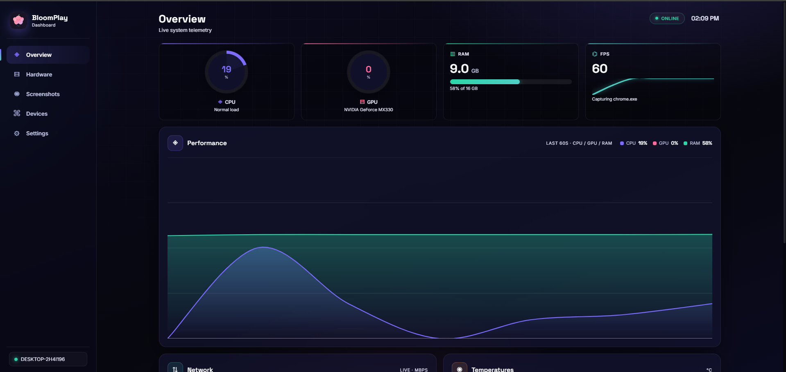
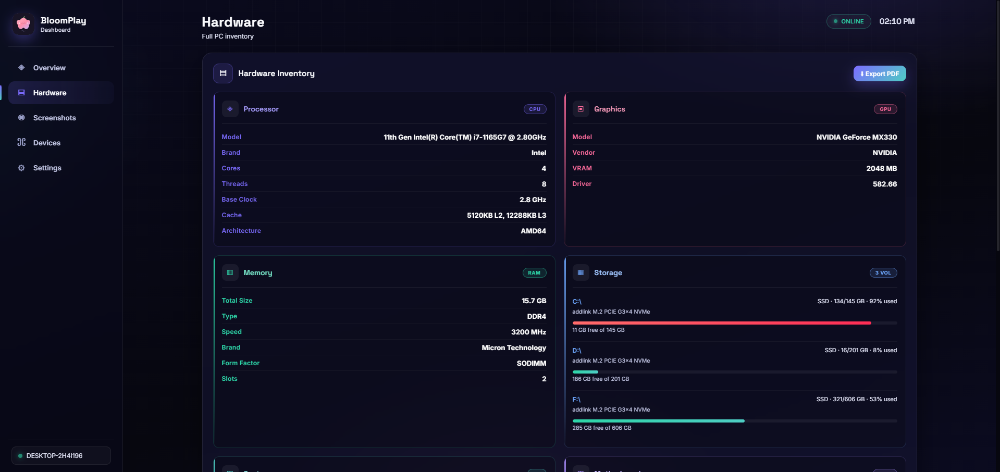
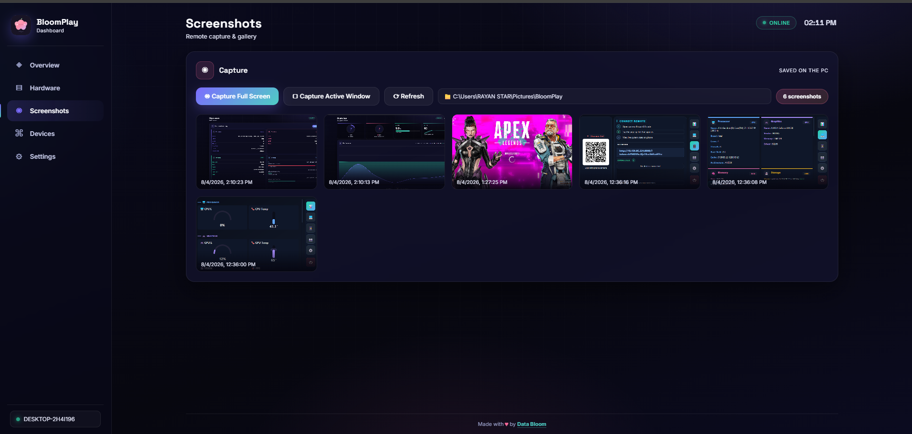
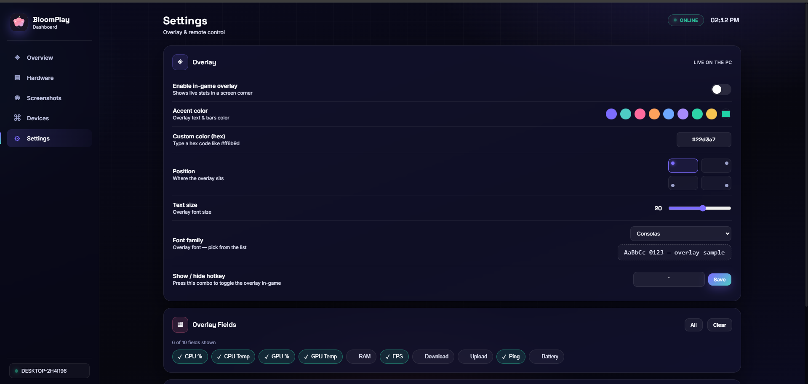
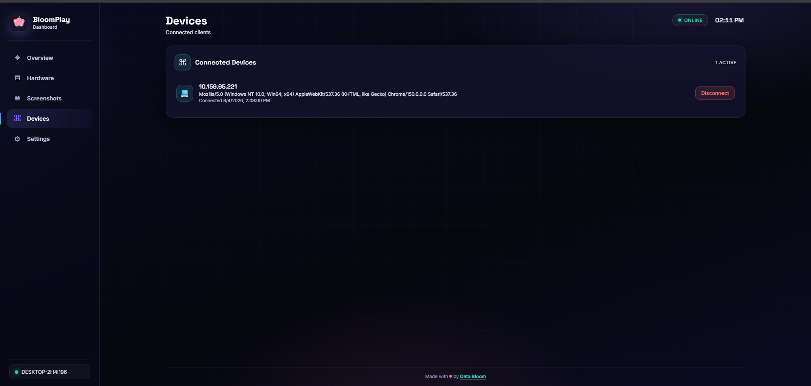
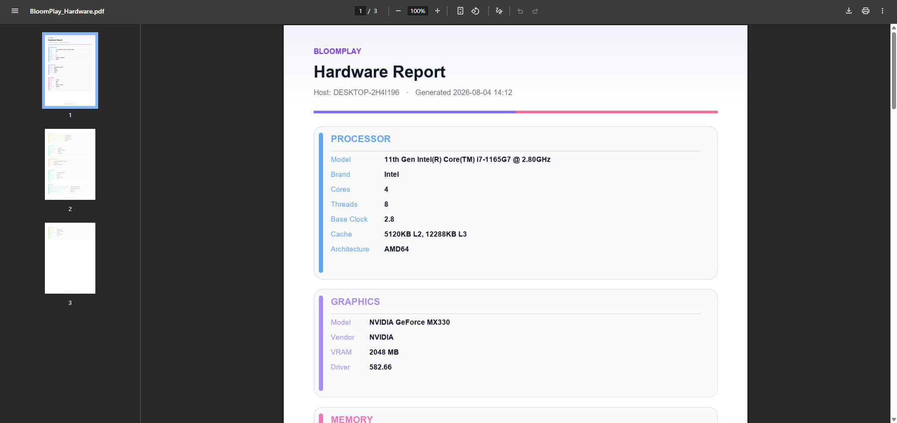
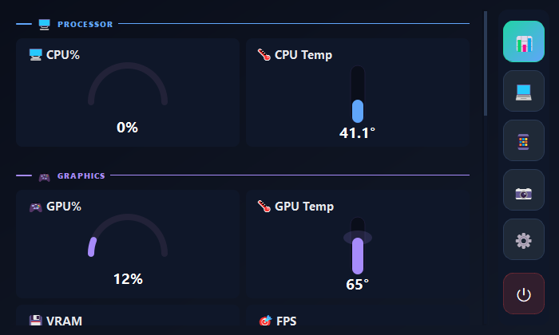
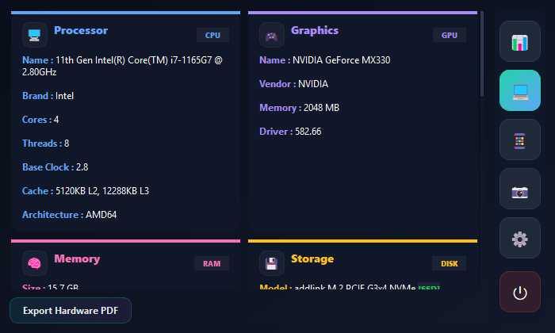
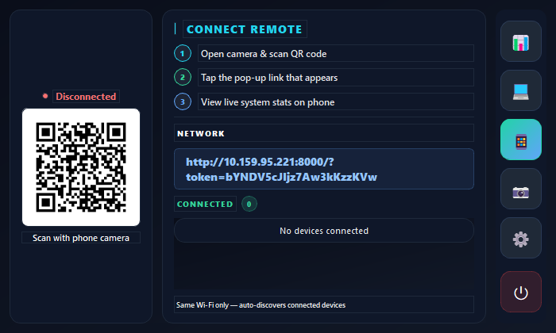

<div align="center">


# 🌸 BloomPlay

### Real-Time Desktop · In-Game · Mobile System Monitoring

Monitor every heartbeat of your PC — from your **desktop**, on top of your **games**, and in your **phone's browser** — all through one beautiful, lightweight, fully-local platform.

[](https://www.python.org)
[](https://www.riverbankcomputing.com/software/pyqt/)
[](https://fastapi.tiangolo.com)
[]()
[]()
[]()

**v2.0** — Built with ❤️ by [Data Bloom](https://linktr.ee/Data_Bloom)

</div>

---

## 📚 Table of Contents

- [✨ What's New in v2](#-whats-new-in-v2)
- [🚀 Quick Start](#-quick-start)
- [📖 Overview](#-overview)
- [🎯 Key Features](#-key-features)
- [🎮 In-Game Overlay](#-in-game-overlay)
- [⚡ Real-Time Monitoring](#-real-time-monitoring)
- [🔍 Hardware Information Center](#-hardware-information-center)
- [📸 Screenshots & Capture](#-screenshots--capture)
- [📄 PDF Hardware Reports](#-pdf-hardware-reports)
- [📱 Mobile Dashboard](#-mobile-dashboard)
- [🔗 Instant QR Connection](#-instant-qr-connection)
- [⚙️ Settings & Customization](#️-settings--customization)
- [📁 Project Structure](#-project-structure)
- [🛠 Tech Stack](#-tech-stack)
- [⚡ Performance Optimized](#-performance-optimized)
- [🛡 Privacy & Security](#-privacy--security)
- [🧭 Roadmap](#-roadmap)
- [📜 License](#-license)

---

## ✨ What's New in v2

| Feature | Description | Status |
| ------- | ----------- | ------ |
| 🎮 **In-Game Overlay** | Floating widget on top of your games — FPS, temps, RAM & more | ✅ **New** |
| 🎯 **FPS Capture** | Real frame-time analysis via PresentMon (needs admin) | ✅ **New** |
| 📄 **PDF Reports** | One-click hardware report — identical on desktop & web | ✅ **New** |
| 🌐 **Persian + English** | Full translation, complete RTL support | ✅ **New** |
| 🎨 **Custom Themes** | Accent color & font picker with live preview | ✅ **New** |
| ⌨️ **Global Hotkeys** | System-wide shortcuts, work even in fullscreen games | ✅ **New** |
| 📸 **Screenshot System** | Remote capture, gallery grid & total counter | ✅ **New** |
| 🔋 **Accurate Battery Health** | Real design/full-capacity ratio from Windows report | ✅ **Fixed** |
| 🖥 **Full Hardware Center** | Monitors, audio devices, network adapters & more | ✅ **Expanded** |
| 📊 **Diverse Charts** | Gauges, thermometers, line charts & sparklines | ✅ **Redesigned** |
| 🚀 **Single-File EXE** | No console window, logs tucked into AppData | ✅ **New** |
| 🔒 **Auto Elevation** | Requests admin only when sensors / PresentMon need it | ✅ **New** |

---

## 🚀 Quick Start

### ▶️ Run from Source

```bash
# 1. Install dependencies
pip install -r requirements.txt

# 2. (Windows) Place PresentMon*.exe + LibreHardwareMonitorLib.dll into src/libs/

# 3. Launch — BloomPlay auto-elevates when needed
python src/launcher.py
```

### 📦 Build a Single-File EXE

```bash
# 1. Generate the icon (once)
python make_icon.py

# 2. Build (requires PyInstaller)
pyinstaller src/launcher_onefile.spec --noconfirm

# 3. Done! → dist/BloomPlay.exe
```

The onefile build has **no console window**, bundles the dashboard + `libs/` + icon, and writes any API logs into `%LOCALAPPDATA%\BloomPlay\` so nothing clutters your folder.

---

## 📖 Overview

BloomPlay is a complete system-monitoring platform that gives you **real-time visibility** into your computer's performance, hardware, network, temperatures and battery health — from **three surfaces at once**:

<table>
<tr>
<td align="center"><h3>💻 Desktop App</h3>A gorgeous dark control center with every metric at a glance</td>
<td align="center"><h3>🎮 In-Game Overlay</h3>A sleek always-on-top widget while you play</td>
<td align="center"><h3>📱 Mobile Dashboard</h3>A responsive web dashboard — zero installation</td>
</tr>
</table>

Unlike traditional monitoring tools, BloomPlay:

- ✅ Works **fully locally** — no cloud, no account, no data leaving your network
- ✅ Runs **quietly in the system tray** without stealing resources
- ✅ Stays **lightweight** even while continuously sampling
- ✅ Supports **Persian & English** out of the box

---

## 🎯 Key Features

| Feature | Description |
| ------- | ----------- |
| 🖥 CPU Monitoring | Usage, temperature, multi-core performance |
| 🎮 GPU Monitoring | Usage, temperature, VRAM, dedicated GPU info |
| 🧠 RAM Monitoring | Capacity, used / available, percentage |
| 🌐 Network Monitoring | Download, upload, live ping & charts |
| 🔋 Battery Monitoring | Charge level, real health %, charging status |
| 💾 Storage Monitoring | Per-drive capacity, used / free, percentage |
| 🎮 In-Game Overlay | FPS, temps & resources while playing |
| 📸 Screenshots | Remote capture + gallery + total count |
| 📄 PDF Reports | Complete hardware report in one click |
| 📱 Mobile Dashboard | Browser-based, QR-powered remote access |
| 🌐 Persian + English | Full translation with RTL support |
| ⌨️ Global Hotkeys | Work everywhere, even fullscreen games |

---

## 🎮 In-Game Overlay

The flagship addition of **v2**. BloomPlay renders a **translucent, always-on-top widget** over your game window showing live:

* **FPS** — captured by PresentMon, real frame-time based (30-frame rolling average)
* GPU usage, temperature & VRAM
* CPU usage & temperature
* RAM usage
* Battery level
* Disk activity

> ⚠️ **Note:** FPS capture uses `PresentMon.exe` (bundled in `src/libs/`) and requires **Administrator** privileges. BloomPlay detects this and auto-elevates — you never have to fight with permissions manually.

---

## ⚡ Real-Time Monitoring

BloomPlay continuously samples your system and pushes **live updates** to every surface.

### 🖥 CPU
* Usage percentage
* Temperature (per-core via LibreHardwareMonitor)
* Live performance tracking
* Multi-core monitoring

### 🎮 GPU
* GPU usage
* GPU temperature
* VRAM usage
* Dedicated graphics information

### 🧠 RAM
* Total capacity
* Used & available memory
* Usage percentage

### 🌐 Network
* Download speed
* Upload speed
* Ping / latency (live, auto-scaled charts)
* Connection monitoring

### 🔋 Battery
* Charge percentage
* **Real battery health** — design vs. full-charge capacity via `powercfg /batteryreport`
* Charging status
* Full battery specs (manufacturer, chemistry, serial, voltage…)

### 💾 Storage
* Per-drive capacity
* Used / free space
* Usage percentage

---

## 🔍 Hardware Information Center

A dedicated inspection center that inventories **every component** of your machine — with color-coded panels and no "Unknown Unknown" clutter (unavailable values are simply omitted).

### 🖥 Processor

| Information | Available |
| ----------- | :--------: |
| CPU Model | ✅ |
| Manufacturer | ✅ |
| Physical Cores | ✅ |
| Logical Threads | ✅ |
| Clock Speed | ✅ |
| Architecture | ✅ |

### 🎮 Graphics

| Information | Available |
| ----------- | :--------: |
| GPU Model | ✅ |
| Vendor | ✅ |
| VRAM Capacity | ✅ |
| Graphics Details | ✅ |

### 🧠 Memory

| Information | Available |
| ----------- | :--------: |
| Total RAM | ✅ |
| RAM Type | ✅ |
| RAM Speed | ✅ |
| Installed Slots | ✅ |
| Manufacturer | ✅ |

### 💾 Storage

| Information | Available |
| ----------- | :--------: |
| Total Storage | ✅ |
| Drive Capacity | ✅ |
| Used / Free Space | ✅ |
| Multi-Drive Support | ✅ |

### 🖥 Display

| Information | Available |
| ----------- | :--------: |
| Monitor Model | ✅ |
| Resolution | ✅ |
| Primary Display Detection | ✅ |

### 🎧 Audio & 🔌 Network

| Information | Available |
| ----------- | :--------: |
| Audio Devices | ✅ |
| Network Adapters | ✅ |

### 🔩 Motherboard & BIOS

| Information | Available |
| ----------- | :--------: |
| Motherboard Model | ✅ |
| Motherboard Vendor | ✅ |
| BIOS Version | ✅ |

### 🪟 System

| Information | Available |
| ----------- | :--------: |
| Operating System | ✅ |
| Windows Version | ✅ |
| Hostname | ✅ |
| Architecture | ✅ |

---

## 📸 Screenshots & Capture

BloomPlay ships with a **full screenshot system**: capture your screen remotely, browse the gallery, and see your **total capture count** at a glance.

### 📱 Mobile / Web Dashboard

<table>
<tr>
<td align="center">
<b>Overview — Live Telemetry</b><br><br>

</td>
<td align="center">
<b>Hardware Inventory</b><br><br>

</td>
</tr>
<tr>
<td align="center">
<b>Screenshot Gallery</b><br><br>

</td>
<td align="center">
<b>Settings — Theme & Hotkeys</b><br><br>

</td>
</tr>
<tr>
<td align="center">
<b>Devices — Connected Clients</b><br><br>

</td>
<td align="center">
<b>PDF Hardware Report</b><br><br>

</td>
</tr>
</table>

### 💻 Desktop App

<table>
<tr>
<td align="center">
<b>Desktop Dashboard</b><br><br>

</td>
<td align="center">
<b>Desktop Hardware Center</b><br><br>

</td>
</tr>
<tr>
<td align="center">
<b>In-Game Overlay</b><br><br>

</td>
<td align="center">
<b>Mobile / QR Connection</b><br><br>

</td>
</tr>
</table>

---

## 📄 PDF Hardware Reports

One click → a **complete, beautifully formatted PDF** of your entire hardware inventory.

* Same report from the **desktop app** and the **web dashboard** — always byte-for-byte identical
* Color-coded sections with your accent theme
* Covers CPU, GPU, RAM, storage, motherboard, BIOS, system & more
* Missing values are **skipped** — never printed as "—"

---

## 📱 Mobile Dashboard

BloomPlay's most-loved feature. **No installation. No account. No cloud.**

1. Launch BloomPlay on your PC
2. Open the **Mobile** page in the desktop app
3. Scan the QR code with your phone
4. Monitor your PC from anywhere on your Wi-Fi

### Mobile Features
* 📊 Live statistics & hardware cards
* 📱 Fully responsive, touch-friendly design
* ⚡ Real-time updates over the local network
* 🌐 Works in any modern browser
* 🔄 Auto-synchronization with the desktop app

---

## 🔗 Instant QR Connection

BloomPlay automatically generates a **QR code** pointing to your local dashboard:

```text
            PC
             │
   FastAPI Server (0.0.0.0:8000)
             │
             ▼
      QR Code (LAN IP)
             │
             ▼
  Mobile Browser on Wi-Fi
             │
             ▼
  Real-Time Dashboard 📊
```

---

## ⚙️ Settings & Customization

BloomPlay puts you in control:

* 🌐 **Language** — English / فارسی (Persian, full RTL)
* 🎨 **Accent Color** — pick any theme color with live preview
* 🔤 **Font Selection** — customize interface typography
* ⌨️ **Global Hotkeys** — system-wide shortcuts (registered natively on Windows)
* 📸 **Screenshot Folder** — choose where captures are saved
* 🔄 **Live Sync** — every setting change applies instantly across app + dashboard

---

## 📁 Project Structure

```text
Bloom-Play/
├── README.md                    # You are here
├── requirements.txt             # Python dependencies
├── assets/                      # Static assets
│   ├── logo/                    # Data Bloom icon.svg
│   ├── icons/                   # BloomPlay.ico
│   └── screenshots/             # README screenshots
└── src/
    ├── launcher.py              # Entry point (API + app + auto-elevation)
    ├── engine.py
    ├── launcher.spec            # PyInstaller (folder) build config
    ├── launcher_onefile.spec    # PyInstaller single-file build config
    ├── api/                     # FastAPI backend
    │   ├── server.py            # Stats, hardware, PDF, screenshots, devices
    │   ├── state.py             # Shared state & caching
    │   └── overlay_config.py    # Settings shared with the overlay
    ├── collectors/              # Hardware & sensor readers
    │   ├── system.py            # CPU / RAM / OS info
    │   ├── gpu.py               # GPU usage, VRAM, temps
    │   ├── network.py           # Download / upload / ping
    │   ├── temperature.py       # Thermal sensors
    │   ├── battery.py           # Health + specs (powercfg/WMI)
    │   ├── hardware.py          # Full inventory + PDF sections builder
    │   ├── hwmonitor.py         # LibreHardwareMonitor bridge
    │   ├── fps.py               # PresentMon FPS capture
    │   └── logger.py
    ├── overlay/
    │   ├── main_window.py       # Desktop control center (PyQt5)
    │   └── overlay_widget.py    # Always-on-top in-game overlay
    ├── dashboard/               # Web dashboard (HTML/CSS/JS)
    │   ├── index.html
    │   ├── app.js
    │   ├── style.css
    │   └── _preview.html        # Standalone preview build
    ├── utils/
    │   ├── elevate.py           # Admin elevation
    │   ├── ip.py                # Local network IP detection
    │   └── qr.py                # QR code generation
    └── libs/                    # PresentMon.exe, LibreHardwareMonitorLib.dll
```

---

## 🛠 Tech Stack

| Category | Technologies |
| -------- | ------------ |
| Backend | Python, FastAPI, Uvicorn |
| Desktop UI | PyQt5 |
| In-Game Overlay | PyQt5 (translucent, always-on-top) |
| Frontend | HTML, CSS, JavaScript |
| Hardware Detection | psutil, WMI, pynvml, GPUtil |
| Temperature Sensors | LibreHardwareMonitorLib (via pythonnet) |
| FPS Capture | PresentMon |
| Networking | ping3, QR Code, local API |
| Reporting | Pillow (PDF), openpyxl |
| Packaging | PyInstaller |

---

## ⚡ Performance Optimized

BloomPlay is designed to live in your system tray **without being noticed**:

* 🗃 **Cached hardware detection** — inventory detected once, not every tick
* 🔁 **Smart polling** — JSON-diff re-rendering prevents UI jumps & flicker
* 📉 **Low resource usage** — bounded history buffers, minimal CPU overhead
* 🕶 **Background monitoring** — runs quietly in the system tray
* 🧹 **Clean output** — single-file EXE, no console, logs in AppData

---

## 🛡 Privacy & Security

* 🔒 **100% local** — all monitoring stays on your network; nothing is uploaded
* 📶 **LAN-only dashboard** — your PC's IP on your Wi-Fi, no public exposure
* 🔑 **Admin only when needed** — elevation is requested only for sensors / PresentMon

---

## 🧭 Roadmap

* ⚙️ Process manager & per-app network monitoring
* 🌡 Temperature history & trend graphs
* 📊 Persistent performance graphs & export (CSV / Excel)
* 📶 Multi-device monitoring across networks
* 🍃 macOS / Linux support

---

## 🤖 AI-Assisted Development

BloomPlay was developed with the assistance of modern AI tools:

- **ChatGPT**
- **DeepSeek**

---

## 📜 License

Distributed under the **MIT License**.

---

<div align="center">

### 🌸 Made with ❤️, passion & many late-night debugging sessions by Data Bloom

[🔗 linktr.ee/Data_Bloom](https://linktr.ee/Data_Bloom) · [🐙 github.com/The-DataBloom](https://github.com/The-DataBloom)

</div>
